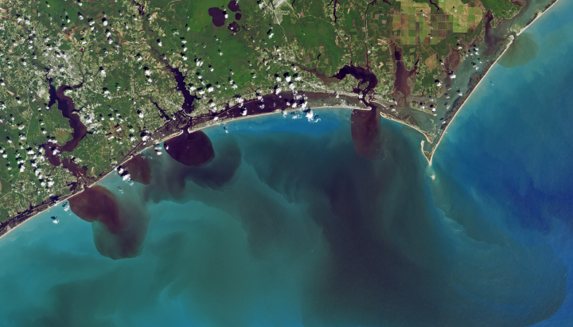

### Project Overview

Remote sensing plays a critical role in the study and management of coastal ecosystems (Figure 1). As a key example, satellite imagery enables accurate land cover mapping at medium resolution (Figure 2) and these land cover maps can be compared from year to year to understand large scale change and ecosystem dynamics. Unoccupied aerial systems (UAS, aka drones) complement satellites, providing on-demand remote sensing capabilities at low cost and with modular sensors that can assess a wide variety of variables.

Figure 1. The view of southeastern North Carolina days after the impact of Hurricane Florence in September 2018 from Landsat 8. Image Credit: NASA/USGS.

Figure 2. A map of elevation and landcover in eastern North Carolina.

While powerful tools, satellites and UAS generate massive amounts of data. The expertise and time required to analyze this imagery is an obstacle in using it to understand long term land cover dynamics and quickly analyze impacts of storms – an obstacle machine learning is well poised to mitigate.

The purpose of this project is to develop a methodology for rapid and high-resolution monitoring of the coastal Southeast US.
We will do so by leveraging deep learning to automate land cover mapping in satellite imagery. The change detected by comparing yearly land cover maps will guide UAS surveys for areas that experienced substantial change.

### Student Profiles and Projects

#### Diego Chamarro

Diego is a student at Duke University double majoring in Electrical & Computer Engineering and Computer Science. He is passionate about using technology to tackle difficult and large-scale problems. Through the Bass Connections program, he has been able to explore his interest in Deep Learning and received significant mentorship that has sharpened his research skills.

<object data="Diego_Chamorro_Bass_Connections_Poster_edited.pdf" type="application/pdf" width="700px" height="525px">
    <embed src="Diego_Chamorro_Bass_Connections_Poster_edited.pdf">
        
This browser does not support PDFs. Please download the PDF to view it: <a href="Diego_Chamorro_Bass_Connections_Poster_edited.pdf">Download PDF</a>.

    </embed>
</object>

#### Kendall Jefferys

Kendall Jefferys is an undergrad at Duke University double majoring in Environmental Science and Policy with a Marine Concentration as well as English. She is a Rachel Carson Scholar and will be to studying at the Duke Marine Lab in Spring 2020. Through Bass Connections, she has been working on applying remote sensing to ecological questions around coastal change and storm impacts, primarily working on various techniques of land cover classification in Google Earth Engine, as well as land cover analysis in R.

<object data="Kendall_Jefferys_Bass_Connections_Poster_edited.pdf" type="application/pdf" width="700px" height="525px">
    <embed src="Kendall_Jefferys_Bass_Connections_Poster_edited.pdf">
        
This browser does not support PDFs. Please download the PDF to view it: <a href="Kendall_Jefferys_Bass_Connections_Poster_edited.pdf">Download PDF</a>.

    </embed>
</object>

#### Sofia Nieto
Sofia Nieto is a junior studying Computer Science and Biology at Duke University. She has previously done research on utilizing augmented reality to better assess concussions and the mitochondrial protein mitofilin. In the spring semester, she will be studying at the Duke Marine Lab and is interested in continuing to find ways to combine her interests in coastal and marine ecology and data science.

<object data="Sofia_Nieto_Bass_Connections_Poster_edited.pdf" type="application/pdf" width="700px" height="525px">
    <embed src="Sofia_Nieto_Bass_Connections_Poster_edited.pdf">
        
This browser does not support PDFs. Please download the PDF to view it: <a href="Sofia_Nieto_Bass_Connections_Poster_edited.pdf">Download PDF</a>.

    </embed>
</object>

#### Yousuf Rehman
Yousuf Rehman is a senior majoring in Electrical & Computer Engineering at Duke University. He is interested in developing deep learning and artificial intelligence techniques to solve problems in computer vision, smart cameras, and environmental conservation. Yousuf hopes to apply deep learning skills to large-scale problems and is currently working on a new type of loss function.

<object data="Yousuf_Rehman_Bass_Connections_Poster_edited.pdf" type="application/pdf" width="700px" height="525px">
    <embed src="Yousuf_Rehman_Bass_Connections_Poster_edited.pdf">
        
This browser does not support PDFs. Please download the PDF to view it: <a href="Yousuf_Rehman_Bass_Connections_Poster_edited.pdf">Download PDF</a>.

    </embed>
</object>

#### Team Leadership
This team is lead by [Patrick Gray](https://nicholas.duke.edu/people/students/gray), [Justin Ridge](https://sites.duke.edu/justinridge/), and [David Johnston](https://nicholas.duke.edu/people/faculty/johnston), of the [Marine Robotics and Remote Sensing Lab](https://sites.nicholas.duke.edu/uas/) at the Duke University Marine Lab. 

### About the Project
This project was funded by [Duke Bass Connections](https://bassconnections.duke.edu/) a program that "bridges the classroom and the real world, giving students a chance to roll up their sleeves and tackle complex societal problems." Teams of graduate students, postdocs, faculty, and undergraduate students collaborate on novel research projects across disciplines. The project was run primarily by the [Marine Robotics and Remote Sensing](https://sites.nicholas.duke.edu/uas/) at the [Duke Marine Lab](https://nicholas.duke.edu/marinelab).

Computational expenses on Microsoft Azure were supported by the [Microsoft AI for Earth](https://www.microsoft.com/en-us/ai/ai-for-earth) program. [North Carolina Space Grant](https://ncspacegrant.ncsu.edu/) and the NASA Future Investigators in NASA Earth and Space Science and Technology (FINESST) supported graduate student time.
